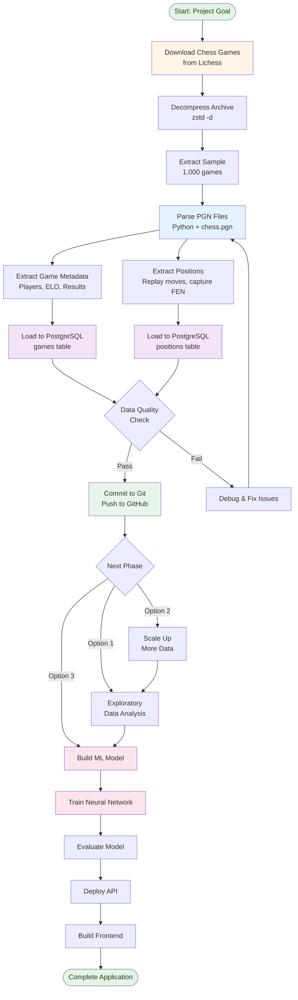

# Chess ML Pipeline - Workflow Diagram

```mermaid
graph TB
    Start([Start: Project Goal]) --> Download[Download Chess Games<br/>from Lichess]
    
    Download --> Decompress[Decompress Archive<br/>zstd -d]
    
    Decompress --> Sample[Extract Sample<br/>1,000 games]
    
    Sample --> Parse[Parse PGN Files<br/>Python + chess.pgn]
    
    Parse --> ExtractGames[Extract Game Metadata<br/>Players, ELO, Results]
    
    Parse --> ExtractPos[Extract Positions<br/>Replay moves, capture FEN]
    
    ExtractGames --> LoadGames[Load to PostgreSQL<br/>games table]
    
    ExtractPos --> LoadPos[Load to PostgreSQL<br/>positions table]
    
    LoadGames --> Verify{Data Quality<br/>Check}
    LoadPos --> Verify
    
    Verify -->|Pass| Commit[Commit to Git<br/>Push to GitHub]
    Verify -->|Fail| Debug[Debug & Fix Issues]
    
    Debug --> Parse
    
    Commit --> NextPhase{Next Phase}
    
    NextPhase -->|Option 1| EDA[Exploratory<br/>Data Analysis]
    NextPhase -->|Option 2| Scale[Scale Up<br/>More Data]
    NextPhase -->|Option 3| ML[Build ML Model]
    
    EDA --> ML
    Scale --> EDA
    
    ML --> Train[Train Neural Network]
    Train --> Evaluate[Evaluate Model]
    Evaluate --> Deploy[Deploy API]
    Deploy --> Frontend[Build Frontend]
    Frontend --> End([Complete Application])
    
    style Start fill:#e1f5e1
    style End fill:#e1f5e1
    style Download fill:#fff4e6
    style Parse fill:#e3f2fd
    style LoadGames fill:#f3e5f5
    style LoadPos fill:#f3e5f5
    style Commit fill:#e8f5e9
    style ML fill:#fce4ec
    style Train fill:#fce4ec
```
