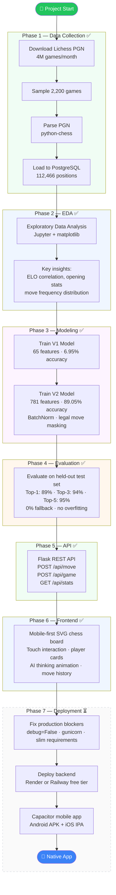

# Chess AI — Full Project Workflow

```mermaid
graph TB
    Start([🏁 Project Start]) --> DL

    subgraph Phase1["Phase 1 — Data Collection ✅"]
        DL[Download Lichess PGN\n4M games/month]
        DL --> Sample[Sample 2,200 games]
        Sample --> Parse[Parse PGN\npython-chess]
        Parse --> Load[Load to PostgreSQL\n112,466 positions]
    end

    subgraph Phase2["Phase 2 — EDA ✅"]
        Load --> EDA[Exploratory Data Analysis\nJupyter + matplotlib]
        EDA --> Insights[Key insights:\nELO correlation, opening stats\nmove frequency distribution]
    end

    subgraph Phase3["Phase 3 — Modeling ✅"]
        Insights --> V1[Train V1 Model\n65 features · 6.95% accuracy]
        V1 --> V2[Train V2 Model\n781 features · 89.05% accuracy\nBatchNorm · legal move masking]
    end

    subgraph Phase4["Phase 4 — Evaluation ✅"]
        V2 --> Eval[Evaluate on held-out test set\nTop-1: 89% · Top-3: 94% · Top-5: 95%\n0% fallback · no overfitting]
    end

    subgraph Phase5["Phase 5 — API ✅"]
        Eval --> API[Flask REST API\nPOST /api/move\nPOST /api/game\nGET /api/stats]
    end

    subgraph Phase6["Phase 6 — Frontend ✅"]
        API --> FE[Mobile-first SVG chess board\nTouch interaction · player cards\nAI thinking animation · move history]
    end

    subgraph Phase7["Phase 7 — Deployment ⏳"]
        FE --> Fix[Fix production blockers\ndebug=False · gunicorn · slim requirements]
        Fix --> Deploy[Deploy backend\nRender or Railway free tier]
        Deploy --> Cap[Capacitor mobile app\nAndroid APK + iOS IPA]
        Cap --> End([📱 Native App])
    end

    style Start fill:#22c55e,color:#fff
    style End fill:#3b82f6,color:#fff
    style Phase1 fill:#f0fdf4
    style Phase2 fill:#eff6ff
    style Phase3 fill:#fdf4ff
    style Phase4 fill:#fff7ed
    style Phase5 fill:#f0fdf4
    style Phase6 fill:#eff6ff
    style Phase7 fill:#fafafa,stroke:#d1d5db,stroke-dasharray:5
```
