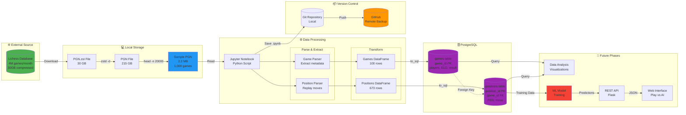

# Chess ML Pipeline - Data Flow Diagram

```mermaid
graph LR
    subgraph External["🌐 External Source"]
        Lichess[(Lichess Database<br/>4M games/month<br/>30GB compressed)]
    end
    
    subgraph Local["💻 Local Storage"]
        Compressed[PGN.zst File<br/>30 GB]
        Decompressed[PGN File<br/>215 GB]
        Sample[Sample PGN<br/>2.2 MB<br/>1,000 games]
    end
    
    subgraph Processing["⚙️ Data Processing"]
        Jupyter[Jupyter Notebook<br/>Python Script]
        
        subgraph Parse["Parse & Extract"]
            GameParser[Game Parser<br/>Extract metadata]
            PosParser[Position Parser<br/>Replay moves]
        end
        
        subgraph Transform["Transform"]
            GameDF[Games DataFrame<br/>100 rows]
            PosDF[Positions DataFrame<br/>673 rows]
        end
    end
    
    subgraph Database["🗄️ PostgreSQL"]
        GamesTable[(games table<br/>game_id PK<br/>players, ELO, result)]
        PositionsTable[(positions table<br/>position_id PK<br/>game_id FK<br/>FEN, move)]
    end
    
    subgraph VersionControl["📦 Version Control"]
        Git[(Git Repository<br/>Local)]
        GitHub[(GitHub<br/>Remote Backup)]
    end
    
    subgraph NextPhase["🔮 Future Phases"]
        Analysis[Data Analysis<br/>Visualizations]
        ML[ML Model<br/>Training]
        API[REST API<br/>Flask]
        Frontend[Web Interface<br/>Play vs AI]
    end
    
    Lichess -->|Download| Compressed
    Compressed -->|zstd -d| Decompressed
    Decompressed -->|head -n 20000| Sample
    
    Sample -->|Read| Jupyter
    Jupyter --> GameParser
    Jupyter --> PosParser
    
    GameParser --> GameDF
    PosParser --> PosDF
    
    GameDF -->|to_sql| GamesTable
    PosDF -->|to_sql| PositionsTable
    
    GamesTable -.->|Foreign Key| PositionsTable
    
    Jupyter -->|Save .ipynb| Git
    Git -->|Push| GitHub
    
    GamesTable -->|Query| Analysis
    PositionsTable -->|Query| Analysis
    
    PositionsTable -->|Training Data| ML
    ML -->|Predictions| API
    API -->|JSON| Frontend
    
    style Lichess fill:#4CAF50
    style Sample fill:#2196F3
    style GamesTable fill:#9C27B0
    style PositionsTable fill:#9C27B0
    style GitHub fill:#FF9800
    style ML fill:#F44336
```
