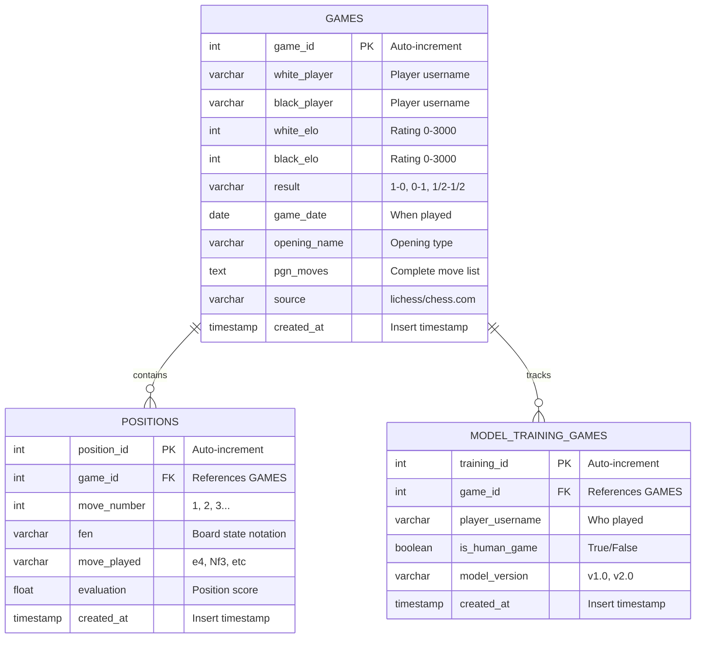

# Chess Database - Entity Relationship Diagram

```mermaid
erDiagram
    GAMES ||--o{ POSITIONS : contains
    GAMES ||--o{ MODEL_TRAINING_GAMES : tracks
    
    GAMES {
        int game_id PK "Auto-increment"
        varchar white_player "Player username"
        varchar black_player "Player username"
        int white_elo "Rating 0-3000"
        int black_elo "Rating 0-3000"
        varchar result "1-0, 0-1, 1/2-1/2"
        date game_date "When played"
        varchar opening_name "Opening type"
        text pgn_moves "Complete move list"
        varchar source "lichess/chess.com"
        timestamp created_at "Insert timestamp"
    }
    
    POSITIONS {
        int position_id PK "Auto-increment"
        int game_id FK "References GAMES"
        int move_number "1, 2, 3..."
        varchar fen "Board state notation"
        varchar move_played "e4, Nf3, etc"
        float evaluation "Position score"
        timestamp created_at "Insert timestamp"
    }
    
    MODEL_TRAINING_GAMES {
        int training_id PK "Auto-increment"
        int game_id FK "References GAMES"
        varchar player_username "Who played"
        boolean is_human_game "True/False"
        varchar model_version "v1.0, v2.0"
        timestamp created_at "Insert timestamp"
    }
```
