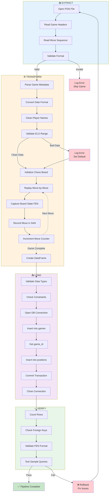

# Chess ML Pipeline - ETL Process Detail

```mermaid
graph TD
    subgraph Extract["📥 EXTRACT"]
        E1[Open PGN File]
        E2[Read Game Headers]
        E3[Read Move Sequence]
        E4[Validate Format]
        
        E1 --> E2
        E2 --> E3
        E3 --> E4
    end
    
    subgraph Transform["⚙️ TRANSFORM"]
        T1[Parse Game Metadata]
        T2[Convert Date Format]
        T3[Clean Player Names]
        T4[Validate ELO Range]
        
        T5[Initialize Chess Board]
        T6[Replay Move-by-Move]
        T7[Capture Board State FEN]
        T8[Record Move in SAN]
        T9[Increment Move Counter]
        
        T1 --> T2
        T2 --> T3
        T3 --> T4
        
        T5 --> T6
        T6 --> T7
        T7 --> T8
        T8 --> T9
        T9 -.->|Next Move| T6
        T9 -.->|Game Complete| L1
    end
    
    subgraph Load["📤 LOAD"]
        L1[Create DataFrame]
        L2[Validate Data Types]
        L3[Check Constraints]
        L4[Open DB Connection]
        L5[Insert into games]
        L6[Get game_id]
        L7[Insert into positions]
        L8[Commit Transaction]
        L9[Close Connection]
        
        L1 --> L2
        L2 --> L3
        L3 --> L4
        L4 --> L5
        L5 --> L6
        L6 --> L7
        L7 --> L8
        L8 --> L9
    end
    
    subgraph Verify["✅ VERIFY"]
        V1[Count Rows]
        V2[Check Foreign Keys]
        V3[Validate FEN Format]
        V4[Test Sample Queries]
        
        V1 --> V2
        V2 --> V3
        V3 --> V4
    end
    
    E4 -->|Valid| T1
    E4 -->|Invalid| Error1[Log Error<br/>Skip Game]
    
    T4 -->|Clean Data| T5
    T4 -->|Bad Data| Error2[Log Error<br/>Set Default]
    Error2 --> T5
    
    L9 --> V1
    V4 -->|Pass| Success[✅ Pipeline Complete]
    V4 -->|Fail| Rollback[❌ Rollback<br/>Fix Issues]
    
    Rollback --> E1
    
    style Extract fill:#e3f2fd
    style Transform fill:#fff3e0
    style Load fill:#f3e5f5
    style Verify fill:#e8f5e9
    style Success fill:#c8e6c9
    style Error1 fill:#ffcdd2
    style Error2 fill:#ffcdd2
    style Rollback fill:#ffcdd2
```
