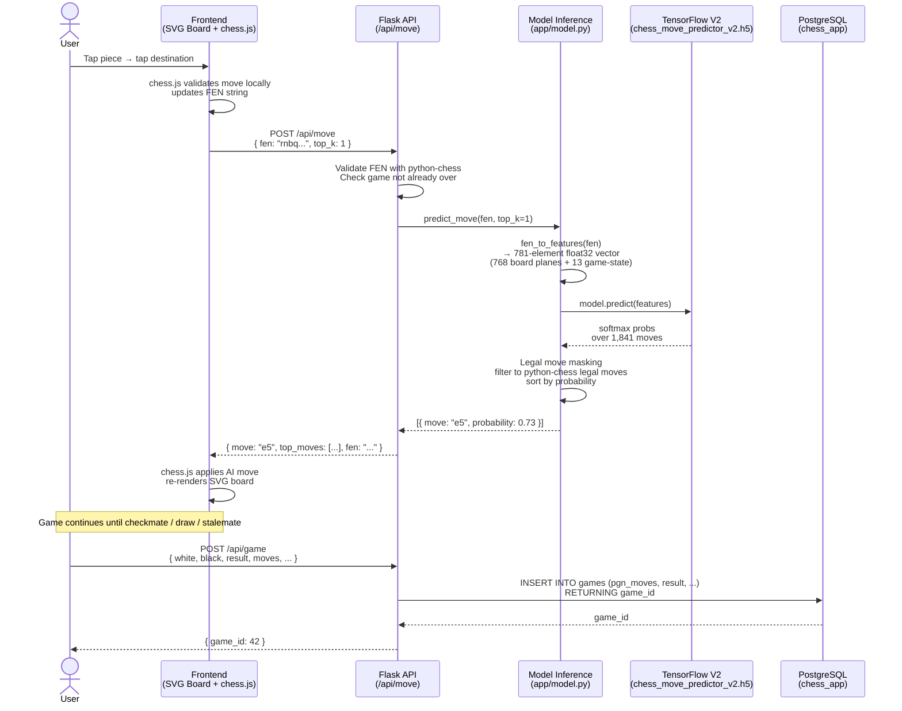
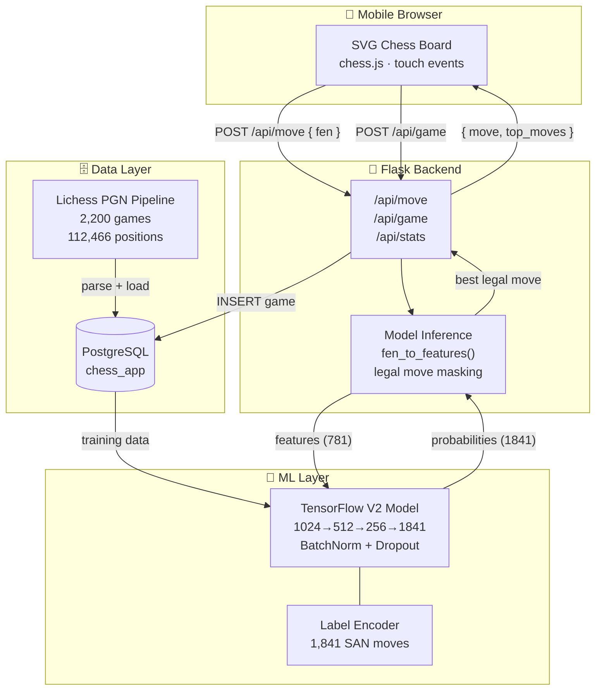

# Gameplay Data Flow

How data moves through the system during a live game.

## Runtime Flow (per move)



---

## Component Architecture



---

## Feature Engineering Detail

Each board position is encoded as a **781-element float32 vector**:

```
[  0 – 767 ]  12 binary planes (64 squares each)
               Plane  0: White pawns       Plane  6: Black pawns
               Plane  1: White knights     Plane  7: Black knights
               Plane  2: White bishops     Plane  8: Black bishops
               Plane  3: White rooks       Plane  9: Black rooks
               Plane  4: White queens      Plane 10: Black queens
               Plane  5: White king        Plane 11: Black king

[       768 ]  Side to move  (1 = White, 0 = Black)

[ 769 – 772 ]  Castling rights  (WK, WQ, BK, BQ)

[ 773 – 780 ]  En passant file  (one-hot, files a–h)
```

---

## Model Performance

| Metric | V1 | V2 |
|---|---|---|
| Training positions | 10,000 | 112,466 |
| Feature size | 65 | **781** |
| Top-1 accuracy | 6.95% | **89.05%** |
| Top-3 accuracy | — | **93.65%** |
| Top-5 accuracy | — | **95.00%** |
| Fallback rate | — | **0.0%** |
| Overfitting gap | — | **+0.69pp ✅** |
